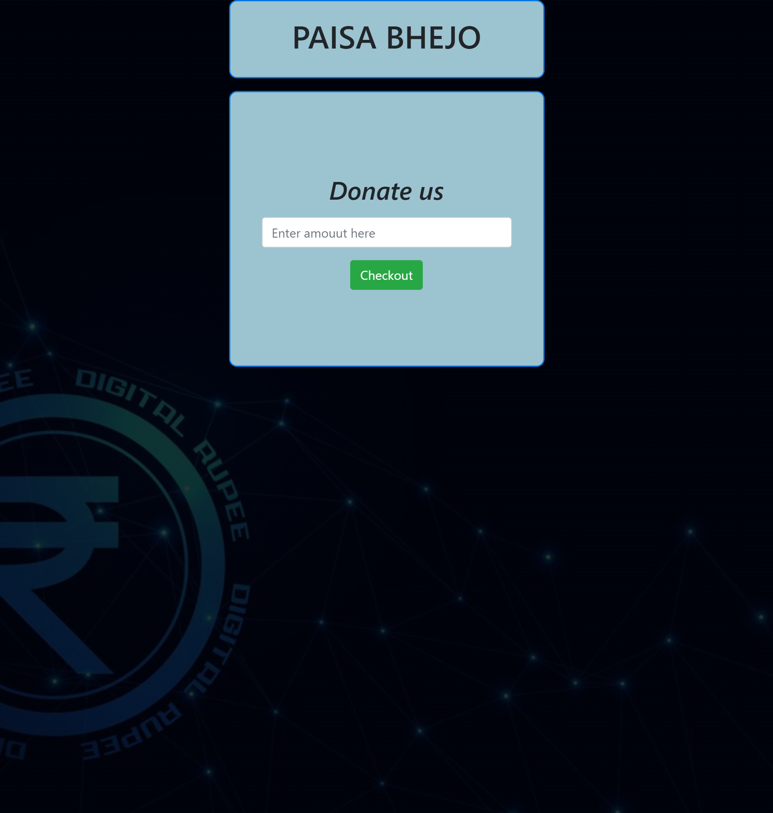

# 💎 Cutting-Edge Payment Integration with Razorpay 💳

Welcome to the forefront of online payment technology! Our Payment Integration with Razorpay is the embodiment of modern convenience, security, and aesthetics. We've seamlessly integrated with the renowned Razorpay gateway, ensuring your transactions are not only lightning-fast but also exceptionally secure. This project marries robustness, beauty, and forward-thinking technology to redefine the online payment experience.

## Key Features

🚀 **Effortless Payments**: We've streamlined the payment process, making it effortlessly simple for users to complete transactions with just a few clicks.

🔐 **Bank-Grade Security**: Your security is our top priority. Rest assured that every transaction is protected with the highest level of security, keeping your data safe.

🌐 **Sleek Web Interface**: The user interface, crafted with HTML, CSS, and JavaScript, is not only visually appealing but also incredibly user-friendly, ensuring a seamless experience.

🔮 **Future-Ready Tech Stack**: Our emoji-inspired technology stack represents our commitment to future readiness. We're not just meeting today's needs; we're preparing for the innovations of tomorrow.

💡 **Continuous Enhancement**: We pledge to continuously enhance our system to incorporate the latest payment technologies and user experience improvements, keeping it ahead of the curve.

## Simplified Technology Stack

- ☕ Java: Core programming language.
- 💳 Razorpay API: Integration for secure payment processing.
- 🌐 HTML, CSS, JavaScript: Crafting a user-friendly and visually appealing web interface.
- 📈 MySQL: Efficient data management.
- 🚀 Future-Ready: Prepared for upcoming technologies.

## Front-Page

## Razorpay Payment Gateway interface

